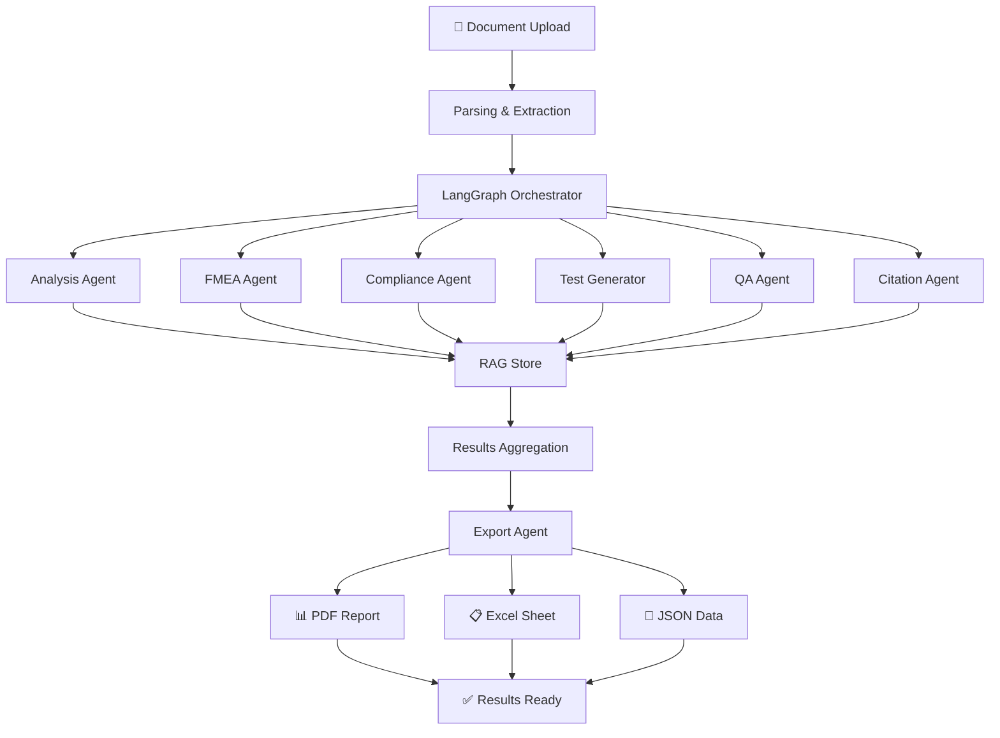

# ReqAI - Plateforme Multi-Agent pour l'Analyse de Requêtes

<div align="center">


Une plateforme d'IA orchestrée pour analyser, valider, et générer des tests sur des documents de requêtes techniques.

</div>

---

## 📋 Table des matières

- [Vue d'ensemble](#vue-densemble)
- [Fonctionnalités principales](#fonctionnalités-principales)
- [Agents disponibles](#agents-disponibles)
- [Architecture](#architecture)
- [Installation](#installation)
- [Configuration](#configuration)
- [Utilisation](#utilisation)
- [Technologies](#technologies)
- [Structure du projet](#structure-du-projet)

---

## 🎯 Vue d'ensemble

**ReqAI** est une plateforme intelligente qui utilise une orchestration multi-agent pour :

- **Analyser** des documents de requêtes techniques complexes
- **Valider** la conformité aux normes (ISO 26262, IEC 62443, etc.)
- **Générer** automatiquement des tests et des matrices de traçabilité
- **Exporter** les résultats en formats professionnels (PDF, Excel)
- **Enrichir** les requêtes avec des données par similarité (RAG)

La plateforme utilise **LangGraph** pour orchestrer plusieurs agents IA spécialisés, chacun exécutant une tâche spécifique dans le workflow d'analyse.

---

## ✨ Fonctionnalités principales

### 1. **Upload et Parsing de Documents**
- Support multiple formats : PDF, Excel, Word
- Extraction automatique du texte et des métadonnées
- Stockage dans Supabase avec indexation

### 2. **Analyse Multi-Dimension**
- Extraction des requêtes techniques
- Identification des patterns et anomalies
- Analyse FMEA (Failure Mode and Effects Analysis)
- Vérification de traçabilité

### 3. **Conformité et Compliance**
- Validation ISO 26262 (sécurité fonctionnelle)
- Conformité IEC 62443 (sécurité cyber)
- Rapports de conformité détaillés
- Recommandations de correction

### 4. **Génération Automatique**
- Cas de test à partir des requêtes
- Matrices de traçabilité (Requirements Traceability Matrix)
- Documentation d'exportation
- Diagrammes de workflow

### 5. **Chat Intelligent**
- Interface conversationnelle pour interroger les documents
- Questions-réponses contextuelles
- Historique des conversations
- Export des discussions

### 6. **QA et Tests**
- Génération de plans de test
- Validation des requêtes
- Détection des ambiguïtés
- Recommandations

---

## 🤖 Agents disponibles

### 1. **Analysis Agent** 📊
**Rôle :** Extraction et analyse des requêtes techniques

- Extrait les requêtes fonctionnelles et non-fonctionnelles
- Identifie les dépendances et les interactions
- Analyse la structure et la qualité du document
- Génère des insights sur les patterns détectés

**Output :** Requêtes structurées, analyse de qualité, dépendances

---

### 2. **FMEA Agent** ⚠️
**Rôle :** Analyse des modes de défaillance et effets

- Identifie les modes de défaillance potentiels
- Évalue la criticité des risques (RPN - Risk Priority Number)
- Recommande des actions correctives
- Compliant avec IEC 60812

**Output :** Matrice FMEA, scores de risque, recommandations

---

### 3. **Compliance Agent** ✅
**Rôle :** Vérification de conformité réglementaire

- Valide contre ISO 26262 (sécurité fonctionnelle)
- Vérifie IEC 62443 (sécurité cyber)
- Contrôle la traçabilité
- Détecte les écarts de conformité

**Output :** Rapports de conformité, violations, recommandations

---

### 4. **Test Generator Agent** 🧪
**Rôle :** Génération automatique de cas de test

- Crée des cas de test depuis les requêtes
- Génère des scénarios de test positifs/négatifs
- Définit les critères d'acceptation
- Produit des plans de test

**Output :** Cas de test, plans de test, scénarios

---

### 5. **QA Agent** 🔍
**Rôle :** Assurance qualité et validation

- Valide la complétude des requêtes
- Détecte les ambiguïtés
- Vérifie la cohérence
- Recommande des améliorations

**Output :** Rapport QA, liste de problèmes, suggestions

---

### 6. **Citation Agent** 📚
**Rôle :** Contextualisation et références

- Identifie les normes applicables
- Extrait les citations des documents
- Établit les références réglementaires
- Mappe les requêtes aux standards

**Output :** Citations, références, mapping normatif

---

### 7. **Export Agent** 📤
**Rôle :** Génération de rapports et exports

- Exporte en PDF formatés
- Génère des fichiers Excel
- Crée des matrices de traçabilité
- Produit de la documentation

**Output :** PDF, Excel, CSV, JSON

---

## 🏗️ Architecture

```
┌─────────────────────────────────────────┐
│     Frontend React (Vite)               │
│  - Dashboard d'analyse                  │
│  - Upload de documents                  │
│  - Chat intelligent                     │
│  - Visualisation des résultats          │
└──────────────┬──────────────────────────┘
               │
               ▼
┌─────────────────────────────────────────┐
│     API Backend (Python FastAPI)        │
│  - Orchestration multi-agent            │
│  - Gestion des documents                │
│  - Routes API RESTful                   │
└──────────────┬──────────────────────────┘
               │
               ▼
┌─────────────────────────────────────────┐
│     LangGraph Orchestrator              │
│  ┌─────────────────────────────────┐   │
│  │ Multi-Agent Workflow            │   │
│  │ - Analysis Agent                │   │
│  │ - FMEA Agent                    │   │
│  │ - Compliance Agent              │   │
│  │ - Test Generator                │   │
│  │ - QA Agent                      │   │
│  │ - Citation Agent                │   │
│  │ - Export Agent                  │   │
│  └─────────────────────────────────┘   │
│  ┌─────────────────────────────────┐   │
│  │ LLM Router                      │   │
│  │ - Groq API                      │   │
│  │ - OpenRouter (Mistral, Kimi)    │   │
│  │ - Ollama (Local)                │   │
│  └─────────────────────────────────┘   │
│  ┌─────────────────────────────────┐   │
│  │ RAG Store (FAISS)               │   │
│  │ - Embeddings vectoriels         │   │
│  │ - Recherche sémantique          │   │
│  └─────────────────────────────────┘   │
└──────────────┬──────────────────────────┘
               │
               ▼
┌─────────────────────────────────────────┐
│     Supabase (PostgreSQL + Auth)        │
│  - Documents                            │
│  - Requêtes                             │
│  - Cas de test                          │
│  - Conversations                        │
│  - Exports                              │
│  - Historique utilisateur               │
└─────────────────────────────────────────┘
```

---

## 🚀 Installation

### Prérequis

- Python 3.9+
- Node.js 18+
- Docker & Docker Compose (optionnel)
- Supabase account (ou local)

### 1. Clone le repository

```bash
git clone https://github.com/BGH-dev22/ReqAI.git
cd ReqAI
```

### 2. Configuration Backend (Python)

```bash
# Créer l'environnement virtuel
python -m venv venv

# Activer (Windows)
venv\Scripts\activate

# Activer (Linux/Mac)
source venv/bin/activate

# Installer les dépendances
pip install -r agents/requirements.txt
```

### 3. Configuration Frontend (Node.js)

```bash
# Installer les dépendances
npm install
# ou
pnpm install

# Compiler
npm run build
```

### 4. Configuration Base de Données

```bash
# Initialiser Supabase (local ou cloud)
supabase init

# Appliquer les migrations
supabase migration up

# ou via Docker Compose
docker-compose up -d
```

---

## ⚙️ Configuration

### Variables d'environnement

Créez un fichier `.env` à la racine :

```bash
# Frontend
VITE_SUPABASE_URL=https://your-project.supabase.co
VITE_SUPABASE_ANON_KEY=your_anon_key

# Backend LLM
LLM_PROVIDER=groq                    # groq, together, fireworks, ollama
GROQ_API_KEY=gsk_xxxx               # Si provider=groq

# TOGETHER_API_KEY=                  # Si provider=together
# FIREWORKS_API_KEY=                 # Si provider=fireworks
# OLLAMA_MODEL=tinyllama             # Si provider=ollama

# OpenRouter (optionnel)
OPENROUTER_MISTRAL_KEY=sk-or-xxxx
OPENROUTER_KIMI_KEY=sk-or-xxxx

# Database
SUPABASE_URL=https://your-project.supabase.co
SUPABASE_SERVICE_KEY=your_service_key
```

### Configuration des modèles LLM

**Modèles supportés :**

| Provider | Modèle | Type | Gratuit |
|----------|--------|------|---------|
| **Groq** | Mixtral-8x7B | Cloud API | ✅ |
| **Groq** | LLaMA-2 70B | Cloud API | ✅ |
| **Together** | Mistral-7B | Cloud API | ✅ |
| **OpenRouter** | Mistral | Cloud API | Payant |
| **OpenRouter** | Kimi 2 | Cloud API | Payant |
| **Ollama** | TinyLLaMA | Local | ✅ |
| **Ollama** | Phi-3 | Local | ✅ |

---

## 💻 Utilisation

### Démarrer la plateforme

```bash
# Terminal 1 - Backend API
cd agents
python api.py

# Terminal 2 - Frontend
npm run dev
```

Accédez à l'application : `http://localhost:5173`

### Workflow typique

1. **📤 Upload** → Chargez un document de requête
2. **🔍 Analyse** → La plateforme lance automatiquement les agents
3. **📊 Résultats** → Consultez les analyses FMEA, compliance, etc.
4. **💬 Chat** → Posez des questions sur le document
5. **📤 Export** → Exportez les résultats en PDF/Excel

### Exemples d'utilisation

#### Analyser une spécification technique

```python
from agents.core.langgraph_orchestrator import Orchestrator

orchestrator = Orchestrator()
result = await orchestrator.analyze_document(
    document_path="spec.pdf",
    analysis_type="full"
)
```

#### Générer des tests

```python
from agents.test_generator_agent.agent import TestGeneratorAgent

agent = TestGeneratorAgent()
test_cases = agent.generate_test_cases(requirements)
```

#### Vérifier la conformité

```python
from agents.compliance_agent.agent import ComplianceAgent

agent = ComplianceAgent()
report = agent.check_compliance(
    requirements=requirements,
    standards=["ISO_26262", "IEC_62443"]
)
```

---

## 🛠️ Technologies

### Frontend
- **React 18** - UI framework
- **Vite** - Build tool
- **TypeScript** - Type safety
- **Tailwind CSS** - Styling
- **Supabase Client** - Database & Auth

### Backend
- **Python 3.9+** - Language
- **FastAPI** - Web framework
- **LangGraph** - Multi-agent orchestration
- **LangChain** - LLM integration
- **FAISS** - Vector search
- **Pydantic** - Data validation

### Infrastructure
- **Supabase** - Database (PostgreSQL) + Auth
- **Docker** - Containerization
- **PostgreSQL** - Primary database
- **FAISS** - Embeddings storage

### LLM & APIs
- **Groq** - Fast LLM inference
- **OpenRouter** - Multi-model access
- **Ollama** - Local LLM inference
- **OpenAI Embeddings** - Vector generation

---

## 📁 Structure du projet

```
ReqAI/
├── agents/                          # Backend Python
│   ├── api.py                      # FastAPI main server
│   ├── requirements.txt            # Python dependencies
│   │
│   ├── core/
│   │   ├── langgraph_orchestrator.py   # Multi-agent orchestrator
│   │   ├── llm_router.py               # LLM routing logic
│   │   └── rag_store.py                # Vector search & RAG
│   │
│   ├── analysis_agent/             # Requirements analysis
│   ├── fmea_agent/                 # Failure analysis
│   ├── compliance_agent/           # Compliance validation
│   ├── test_generator_agent/       # Test case generation
│   ├── qa_agent/                   # Quality assurance
│   ├── citation_agent/             # References & citations
│   └── export_agent/               # Report generation
│
├── src/                            # Frontend React
│   ├── App.tsx
│   ├── main.tsx
│   ├── pages/                      # Page components
│   │   ├── Home.tsx
│   │   ├── Upload.tsx
│   │   ├── Chat.tsx
│   │   ├── History.tsx
│   │   └── ...
│   ├── components/                 # Reusable components
│   │   ├── ChatInterface.tsx
│   │   ├── DocumentUploader.tsx
│   │   ├── FMEAAnalysis.tsx
│   │   ├── ComplianceCheck.tsx
│   │   ├── TraceabilityMatrix.tsx
│   │   └── ...
│   ├── context/                    # State management
│   ├── hooks/                      # Custom hooks
│   ├── lib/                        # Utilities
│   └── types/                      # TypeScript types
│
├── supabase/                       # Database
│   ├── migrations/                 # Schema migrations
│   ├── seed.sql                    # Initial data
│   └── database.types.ts
│
├── data/                           # Data storage
│   ├── embeddings/                 # FAISS vectors
│   ├── metadata/                   # Document metadata
│   ├── processed/                  # Processed documents
│   └── exports/                    # Generated reports
│
├── docker-compose.yml              # Local stack setup
├── Dockerfile.frontend
├── Dockerfile.agents
├── vite.config.ts
└── package.json
```

---

## 📖 Workflow d'analyse complet



---

## 🔐 Sécurité

- ✅ Clés API stockées en variables d'environnement
- ✅ Authentification Supabase (JWT)
- ✅ RLS (Row Level Security) activé
- ✅ Variables sensibles jamais commitées
- ✅ CORS configuré de manière sécurisée

---

## 📞 Support & Documentation

- **Issues** : GitHub Issues
- **Discussions** : GitHub Discussions
- **Documentation** : `docs/` folder
- **API Docs** : `http://localhost:8000/docs` (Swagger UI)

---

## 📝 Licence

Ce projet est sous licence MIT. Voir [LICENSE](LICENSE) pour plus de détails.

---

## 🤝 Contribution

Les contributions sont bienvenues ! Veuillez :

1. Fork le project
2. Créer une branch feature (`git checkout -b feature/AmazingFeature`)
3. Commit vos changements (`git commit -m 'Add some AmazingFeature'`)
4. Push vers la branch (`git push origin feature/AmazingFeature`)
5. Ouvrir une Pull Request

---

## 👨‍💻 Auteur

**BGH-dev22** - Développeur principal

---

**Made with ❤️ for better requirements management**
